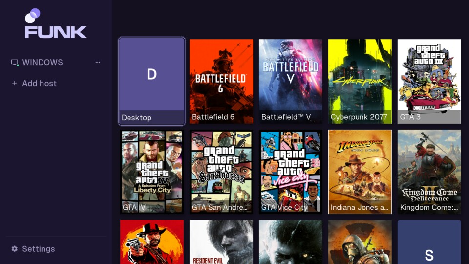
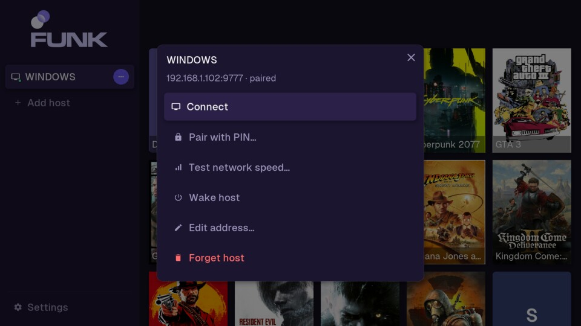
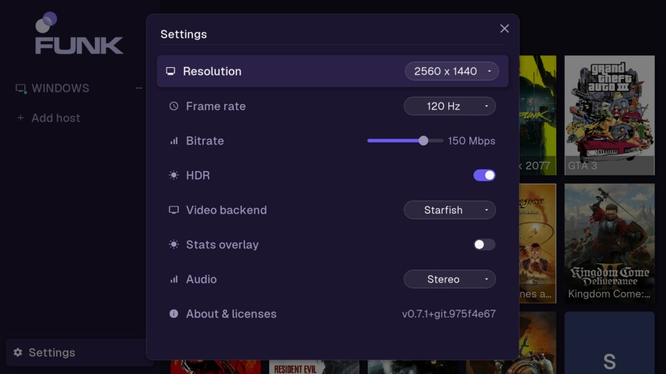

 
 

**Native LG webOS TV client for [punktfunk](https://git.unom.io/unom/punktfunk) — low-latency desktop & game streaming.**

---

Targets webOS 5.x+ (developed and verified live on an **LG CX, webOS 5.6**), packaged as a homebrew
`.ipk`. Built directly on the upstream `punktfunk-core` crate (a pinned git dependency — see
`Cargo.toml`).

Built on the [punktfunk](https://git.unom.io/unom/punktfunk) project by **Enrico Bühler
([unom](https://unom.io))** — all credit for the protocol, FEC/crypto core, and host implementation
belongs there. This repo is only the webOS-specific client: an SDL2 UI, NDL DirectMedia hardware
video decode, and webOS packaging.

## Features

- LAN discovery (mDNS) or add a host manually by IP; PIN pairing with persisted trust.
- Configurable resolution (1080p/1440p/4K), frame rate, bitrate, and HDR.
- Browses the host's game library (with cover art) and launches straight into a title.
- Hardware H.264/H.265 decode via webOS's NDL DirectMedia API; audio via SDL2/PulseAudio.
- Magic Remote friendly: d-pad navigation, pointer hover/click, number-pad PIN/IP entry, and the
  Red button as a Back/disconnect substitute.

<b>Screenshots</b>

  
  
  

## Installing

**Via Homebrew Channel** (recommended — installs/updates from the TV, no laptop needed):

1. Install [Homebrew Channel](https://www.webosbrew.org/) on the TV.
2. Homebrew Channel → Configuration → Add repository →
   `https://raw.githubusercontent.com/dyptan-io/pf-webos/main/repo.json`
3. punktfunk now appears in the Homebrew Channel app list.

Only published [GitHub Releases](https://github.com/dyptan-io/pf-webos/releases) appear this way —
dev/CI builds don't.

**Directly onto a TV** (Developer Mode required): `task deploy TV_HOST=root@<tv-ip>`.

## Development

Everything is a [go-task](https://taskfile.dev) target — the same tasks run locally and in CI.
**Only Docker is required; no local Rust/NDK install needed** (the webOS cross-toolchain ships
Linux-aarch64-only, so builds run in an ephemeral `docker run`, working on amd64 hosts too via
QEMU). Run `task --list` for everything.

| Task | What it does |
| --- | --- |
| `task package` | Build + package `dist/*.ipk` — the one you usually want |
| `task build` / `task check` | Faster inner loop: compile only, or `cargo check` only |
| `task lint` / `task fmt` | `cargo clippy` / `cargo fmt` |
| `task deploy TV_HOST=root@<tv-ip>` | Build, package, install, and launch on a real TV over SSH |
| `task deploy:log TV_HOST=root@<tv-ip>` | Tail the app's log on the TV |
| `task clean` | Remove build output and caches |

Set `TV_HOST` once in a local `.env` (copy `.env.example`) to skip typing it each time. Architecture
and on-device gotchas live in [`docs/NOTES.md`](docs/NOTES.md) and `CLAUDE.md`.

## License

Dual-licensed under [MIT](LICENSE-MIT) or [Apache 2.0](LICENSE-APACHE), matching upstream punktfunk,
at your option.
